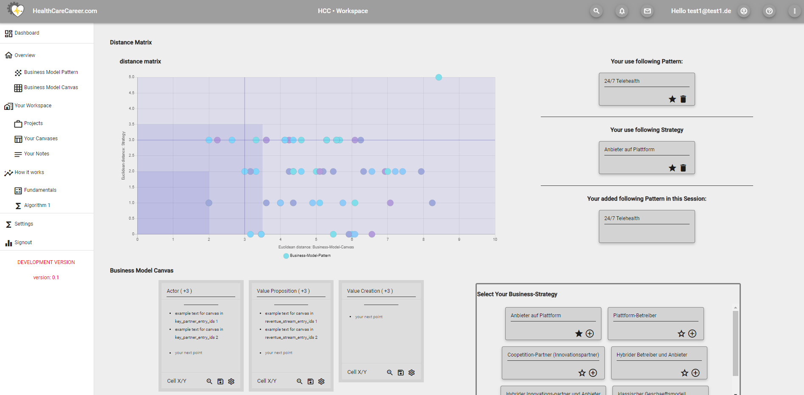

# HealthCareCareer

Web-App to explore and build business-model-pattern for your business in public health care. Create projects, manage your business-model-canvases and get inspired by existing patterns to support you in creating your own new business or scale / expand your current business. This Project is all about the front-end part of the project. The back-end part can be found  [here].



## Prerequisites
* Node v12+

## Getting Started

```$ git clone git@github.com:FlorianTh2/BusinessModelDigitalHealth.git```

```$ cd ./BusinessModelDigitalHealth```

```$ npm install```

```$ ng serve --open```

## Documentation: Angular Modules and Componentes
- app-module
  - about-module
    - contains "about"-site - related component
    - route: /about
  - auth-module
    - contains "auth"-related component
    - routes: /login, /register, /logout
    - components: logn, logout, registrate
    - services: password-validation-service
  - canvas-module
    - represents the "working bench" of the canvas and patter for the user
    - nested resource (under projects)
    - routes: /projects/x/canvases/*
    - components:
      - canvasesList: List of canvases of the user, the user can choose which canvas he wants to edit
      - canvas: base-component for distance-matrix, display-component, table-general, business-model-picker, business-strategy-picker
      - table-general (contains canvas-card): represents the business-model-canvas - representation
      - business-model-picker (contains business-model-card): represents the business-model-pattern the user can choose from
      - business-strategy-picker (contains business-strategy-card): represents the business-model-strategy the user can choose from
    - services: canvas-shared-data-service: holds state for whole canvas-page (working bench), responsible for cross-component-communication
  - core-module
    - contains multiple services like authorization service, email-validation-service, title-service
  - graphql-module
    - location for JWT- and grahpql- apollo- related things
    - reponsible for placing the JWT in to the http-header also though the apollo-pipeline
    - location for the custom graphql-queries which have to be converted into code by the graphql-codegen-package
    - location for generated graphql-codegen code
  - home-module
    - contains landing-page
    - routes: /home
    - components: home
  - legal-notice-module
    - routes: /impressum
  - material-module
    - basic module to include angular material classes for convenience
  - projects-module
    - contains "procjets"-related component
    - routes: /projects
    - components: projects-picker (contains projects-picker-card): lists all projects of given user
  - shared-module
    - contains cross-module shared things e.g. header, sidenav, footer, models, date-pipe,


## Important commands
* npm run generate: generates graphql-code for the application requires graphql-codegen


## Build with

* npm 6
* node 12
* angular 10
* prisma 1
* apollo server
* chart.js
* angular material

## Acknoledgements

* Thanks to my supervisor Mr. T.Knape@Charité Berlin for the help  with this student project


   [here]: <https://github.com/FlorianTh2/BusinessModelDigitalHealthBackend>
   [netlify]: <https://quirky-booth-47a807.netlify.app>
